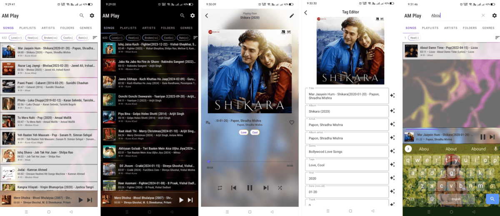

# AM Play – Music Player

## Overview
**AM Play** is a feature-rich and interactive Android music player app designed to provide users with the ultimate music experience. With cutting-edge features and a sleek, glassy UI, AM Play stands out as the go-to choice for music enthusiasts.

---

## Version Information
**Version:** MIN_8.2024.02.26

---

## Features
- **Most Advanced Tagging System**: Organize your music library effortlessly with comprehensive tagging capabilities.
- **Metadata Editor**: Edit and enhance your music files' metadata with precision.
- **Interactive, Beautiful, and Glassy UI**: Enjoy a stunning visual design that supports dark mode.
- **Search with Full Tagging Functionality**: Find your music easily using advanced search options.
- **Setting Controls**: Customize your experience with a variety of settings.
- **Play Bar Control**: Manage playback conveniently from the play bar.
- **And More**: Explore additional features that enhance your music experience.

---

## Installation
Visit my site: [https://mdalmamundev.github.io/](https://mdalmamundev.github.io/)

---

## About the Developer
**Developed By:** Md. Al Mamun

---

## A Note from the Developer
It’s just the beginning… Stay tuned for more exciting updates and features!
